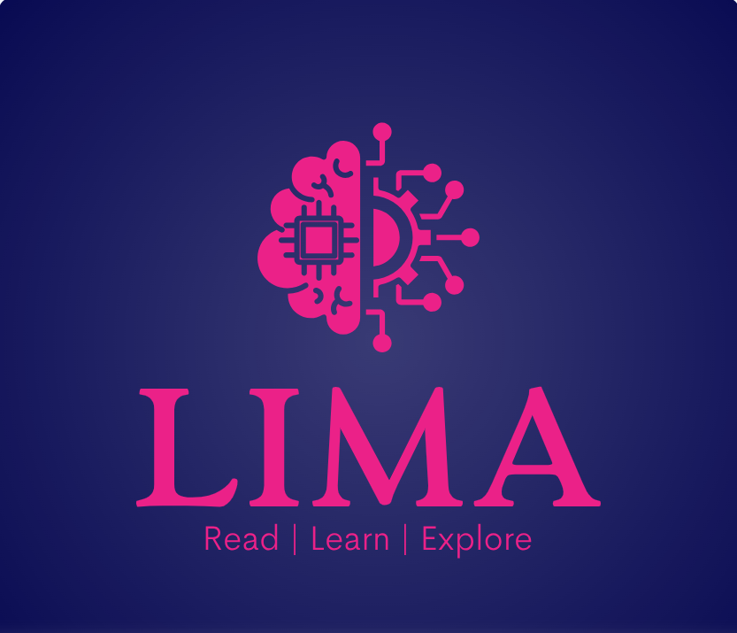

<h1 align = 'center'>
LIMA-Library Intelligence Management Assistan
</h1>

<b> Multimodal AI Interactive Learning & Media Platform</b>

AI - Orchestrated Multi-Tenant Cloud Ecosystem

B2B . B2C . SaaS . HaaS . GaaS

## Overview

LIMA (Library Intelligence Management Assistant) is a cloud-native Multimodal Artificial Intelligence (AI) Interactive Learning & Media Platform designed to modernise libraries, bookstores, educational institutions, and home learning environments.

The platform combines multimodal AI capabilities, cloud computing, interactive media, and intelligent content management to deliver personalised learning experiences through text, images, audio, video, and touch-based interactions. LIMA integrates AI-generated book trailers, intelligent recommendations, interactive kiosks, children's reading displays, the LIMA AI Tablet, and digital management services within a secure multi-tenant ecosystem.

## Multimodal AI Capabilities

LIMA is designed as a Multimodal Artificial Intelligence platform capable of integrating multiple forms of digital content and user interaction into a unified learning ecosystem.

### Supported Modalities

- 📖 Text – Book metadata, summaries, recommendations, and educational content.
- 🖼️ Images – Book covers, illustrations, digital interfaces, and learning materials.
- 🔊 Audio – AI narration, pronunciation support, and reading assistance.
- 🎬 Video – AI-generated book trailers and multimedia educational content.
- 👆 Touch – Interactive kiosks, children's reading displays, and the LIMA AI Tablet.

## Status

**Version:** 1.0

**Project Type:** Solution Architecture Portfolio

**Current Status:** System Design & Prototype

## Core Technologies

### Design & Prototyping

- Figma
- Draw.io
- GitHub

### Cloud Architecture

- Google Cloud Platform (GCP)
- Google Kubernetes Engine (GKE)
- Anthos Service Mesh
- Cloud SQL
- Firestore
- Cloud Storage

### Enterprise Architecture

- REST APIs
- Multi-Tenant Architecture
- SaaS (Software as a Service)
- HaaS (Hardware as a Service)
- GaaS (Generative AI as a Service)

###  Multimodal Artificial Intelligence

- AI Recommendation Engine (Concept)
- AI Book Trailer Generation (Concept)
- AI Reading Assistant (Concept)

## 📖 Documentation

1. [Executive Summary](docs/01-Executive-Summary.md)
2. [Business Requirements](docs/02-Business-Requirements.md)
3. [Solution Architecture & System Diagrams](docs/03-Solution-Architecture-and-System-Diagrams.md)
4. [Cloud Architecture](docs/04-Cloud-Architecture.md)
5. [Database Design](docs/05-Database-Design.md)
6. [Security Architecture](docs/06-Security-Architecture.md)
7. [User Experience](docs/07-User-Experience.md)
8. [Future Roadmap](docs/08-Future-Roadmap.md)
9. [Technology Stack](docs/09-Technology-Stack.md)
10. [Deployment Architecture](docs/10-Deployment-Architecture.md)