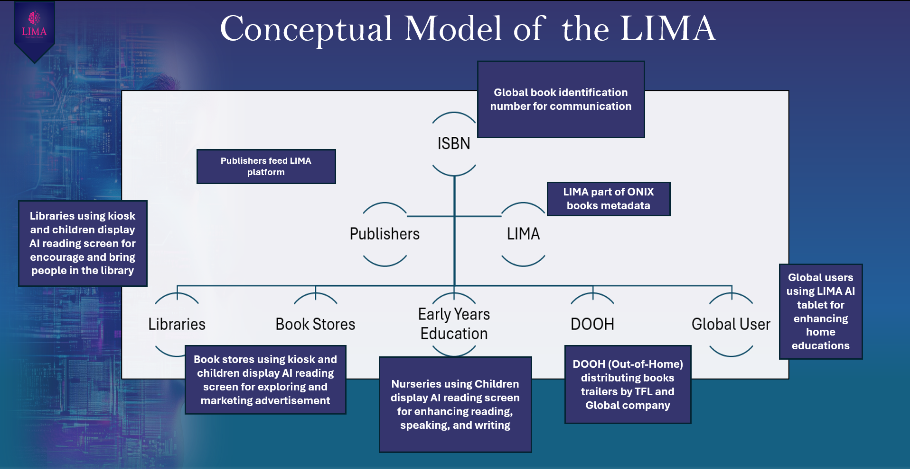
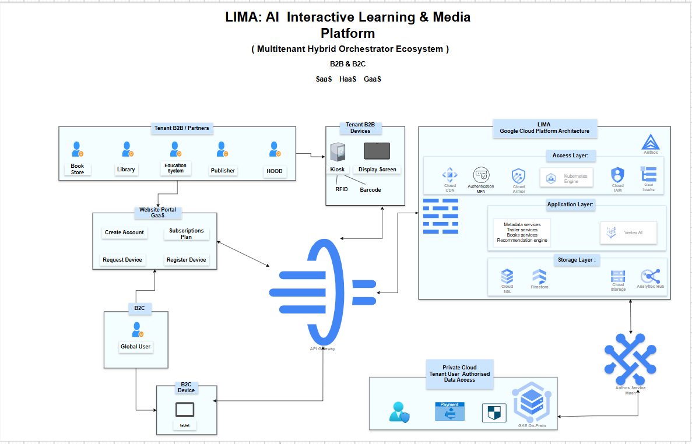

# Solution Architecture

## 1. Introduction

The LIMA (Library Intelligence Management Assistant) platform has been designed as a cloud-based ecosystem that combines Artificial Intelligence, multimedia technologies, and interactive devices to improve how people discover and engage with books.

The solution connects libraries, bookstores, publishers, educational organisations, and readers through a single platform. Each part of the system works together to provide personalised learning experiences, AI-powered recommendations, and secure cloud services.

This document describes the overall solution architecture and explains how the main components communicate to deliver a scalable and secure platform.

---

# 2. Conceptual Model

Before designing the technical architecture, it is important to understand the overall concept of the LIMA platform.

The conceptual model shows the main organisations and users that interact with the platform. Publishers provide book information using the ISBN standard, while LIMA distributes this information to libraries, bookstores, educational organisations, public displays, and global users through different digital services.

    

**Figure 3.1.** Conceptual model of the LIMA platform.

The diagram shows that LIMA acts as the central platform connecting publishers, educational organisations, libraries, bookstores, public digital displays (DOOH), and users. The ISBN is used as the common identifier for exchanging book information, allowing all services to work together using the same book metadata.

---

# 3. High-Level Solution Architecture

The high-level architecture shows how the different parts of the LIMA platform communicate with each other.

The solution supports both Business-to-Business (B2B) and Business-to-Consumer (B2C) users through a secure cloud platform. Organisations such as libraries, bookstores, publishers, and schools can register as tenants, while individual users can access learning services through the AI tablet.

    

**Figure 3.2.** High-level architecture of the LIMA platform.

The architecture is organised around several main components:

- Tenant organisations register through the Website Portal.
- Library kiosks and children's reading displays connect through the cloud platform.
- Global users access personalised learning using the AI tablet.
- All communication passes through the API Gateway.
- Cloud services provide authentication, AI processing, data storage, analytics, and content management.
- Anthos enables communication between Google Cloud Platform and the private cloud environment.

This design allows every device to use the same cloud services while keeping each organisation's data secure and separate.

---

## 4. Architecture Principles

The LIMA platform has been designed using the following principles:

- Cloud-first architecture
- Modular system design
- Multi-tenant platform
- Secure communication
- Scalable infrastructure
- High availability
- Easy maintenance
- Future AI integration

These principles make the platform easier to manage and allow new services to be added without changing the overall architecture.

---

## Summary

The solution architecture provides a clear view of how the different parts of the LIMA platform work together. The conceptual model explains the business idea, while the high-level architecture shows how users, devices, cloud services, and AI components communicate within one secure platform.

The following section describes the API architecture, explaining how all platform components exchange data using secure REST APIs.