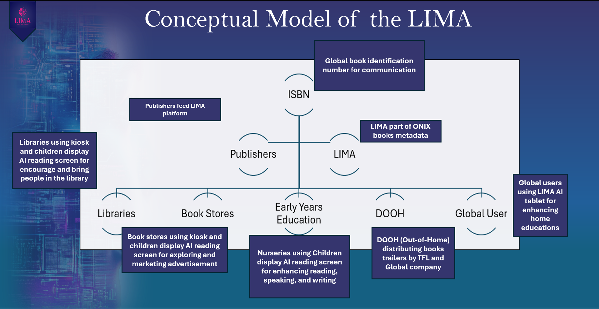
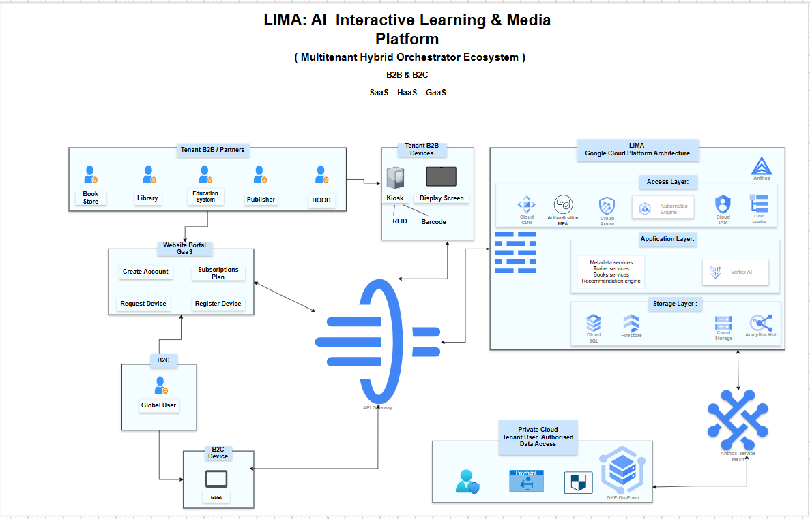
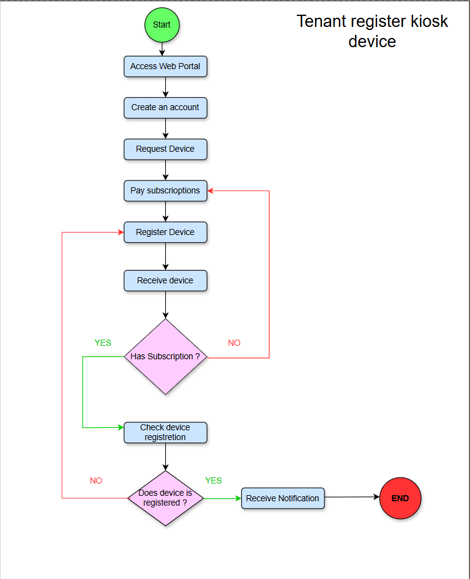
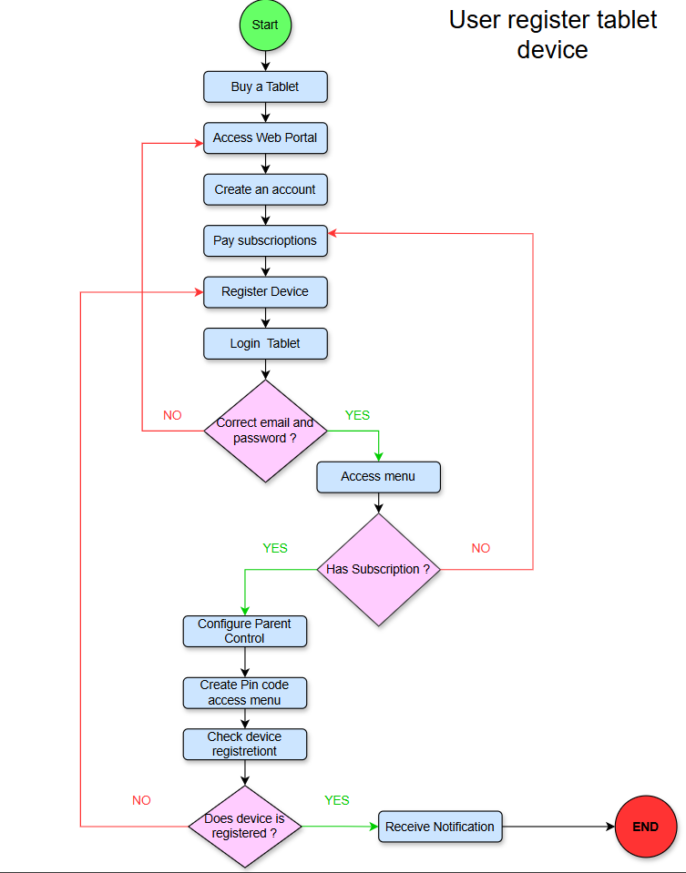
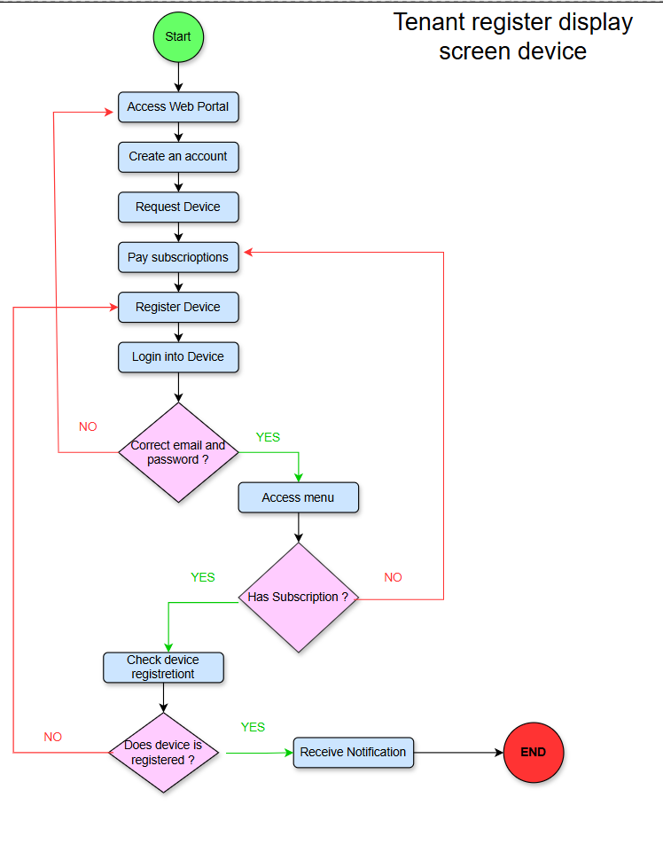
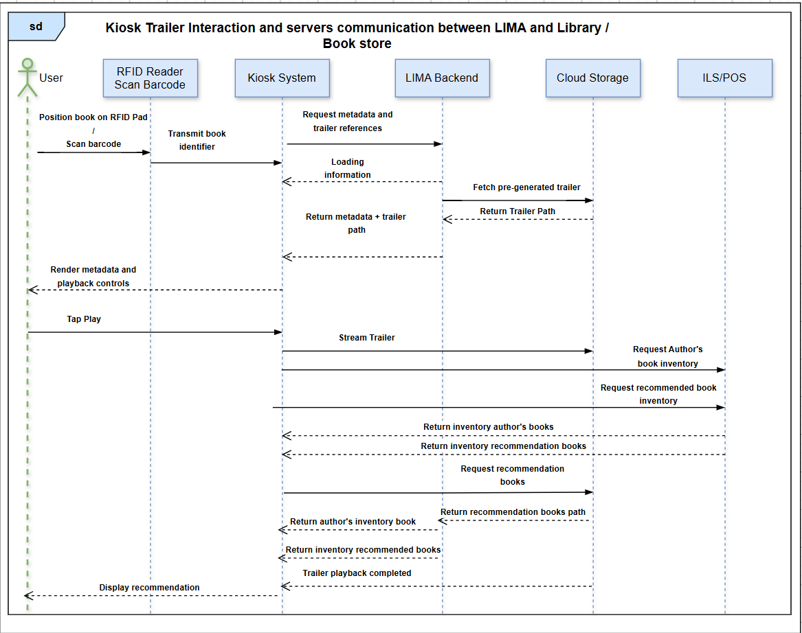
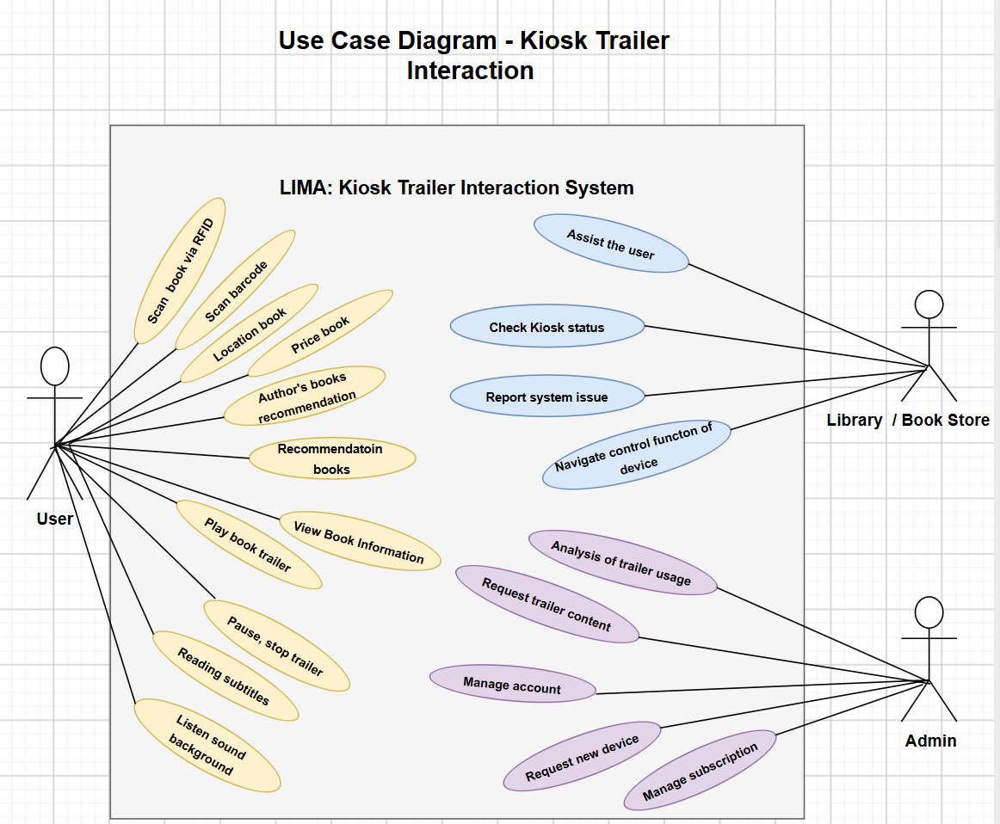
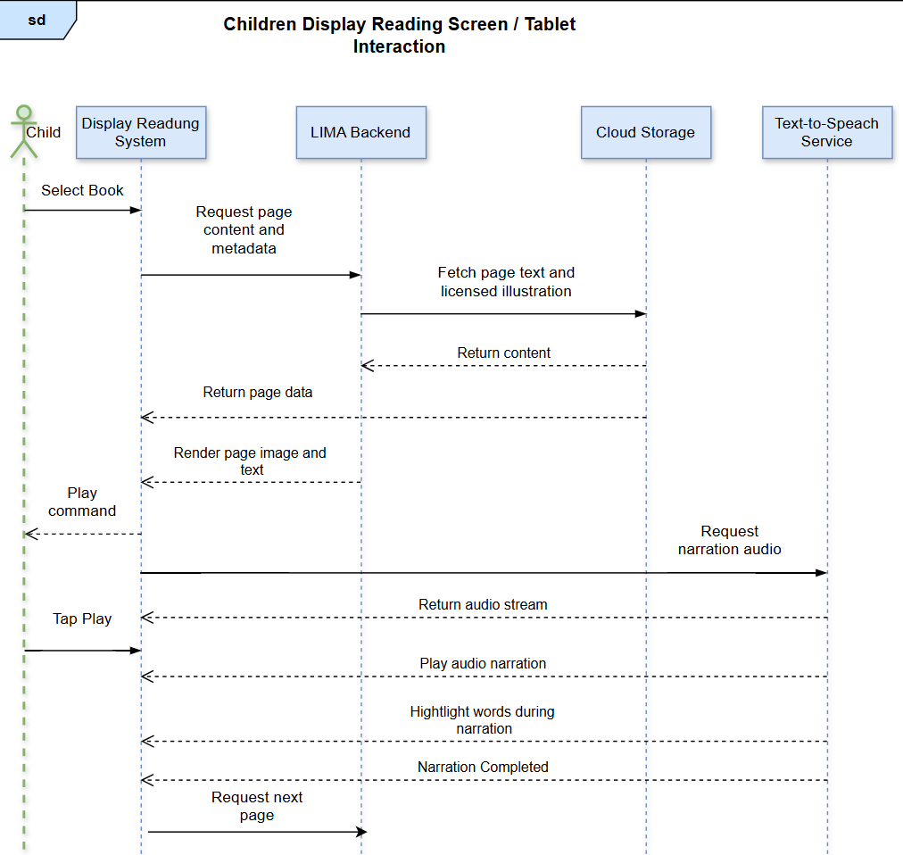
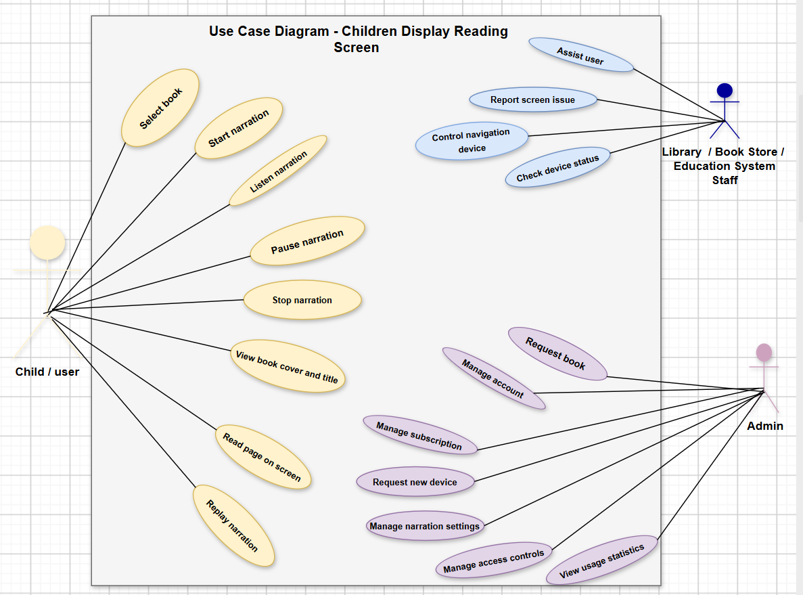

# Solution Architecture

## 1. Introduction

The LIMA (Library Intelligence Management Assistant) platform has been designed as a cloud-based ecosystem that combines Artificial Intelligence, multimedia technologies, and interactive devices to improve how people discover and engage with books.

The solution connects libraries, bookstores, publishers, educational organisations, and readers through a single platform. Each part of the system works together to provide personalised learning experiences, AI-powered recommendations, and secure cloud services.

This document describes the overall solution architecture and explains how the main components communicate to deliver a scalable and secure platform.

---

# 2. Conceptual Model

Before designing the technical architecture, it is important to understand the overall concept of the LIMA platform.

The conceptual model shows the main organisations and users that interact with the platform. Publishers provide book information using the ISBN standard, while LIMA distributes this information to libraries, bookstores, educational organisations, public displays, and global users through different digital services.

    

**Figure 3.1.** Conceptual model of the LIMA platform.

The diagram shows that LIMA acts as the central platform connecting publishers, educational organisations, libraries, bookstores, public digital displays (DOOH), and users. The ISBN is used as the common identifier for exchanging book information, allowing all services to work together using the same book metadata.

---

# 3. High-Level Solution Architecture

The high-level architecture shows how the different parts of the LIMA platform communicate with each other.

The solution supports both Business-to-Business (B2B) and Business-to-Consumer (B2C) users through a secure cloud platform. Organisations such as libraries, bookstores, publishers, and schools can register as tenants, while individual users can access learning services through the AI tablet.

    

**Figure 3.2.** High-level architecture of the LIMA platform.

The architecture is organised around several main components:

- Tenant organisations register through the Website Portal.
- Library kiosks and children's reading displays connect through the cloud platform.
- Global users access personalised learning using the AI tablet.
- All communication passes through the API Gateway.
- Cloud services provide authentication, AI processing, data storage, analytics, and content management.
- Anthos enables communication between Google Cloud Platform and the private cloud environment.

This design allows every device to use the same cloud services while keeping each organisation's data secure and separate.

---

## 4. Architecture Principles

The LIMA platform has been designed using the following principles:

- Cloud-first architecture
- Modular system design
- Multi-tenant platform
- Secure communication
- Scalable infrastructure
- High availability
- Easy maintenance
- Future AI integration

These principles make the platform easier to manage and allow new services to be added without changing the overall architecture.

---

## Summary

The solution architecture provides a clear view of how the different parts of the LIMA platform work together. The conceptual model explains the business idea, while the high-level architecture shows how users, devices, cloud services, and AI components communicate within one secure platform.

The following section describes the API architecture, explaining how all platform components exchange data using secure REST APIs.

# 5. Platform Components

## 5.1 LIMA Website Portal

### Overview

The LIMA Website Portal is the central access and management interface for tenant organisations, individual users, and platform administrators. It allows libraries, bookstores, schools, nurseries, and other organisations to create tenant accounts, select subscription services, request devices, register delivered devices, manage branches, and receive platform notifications.

Individual users can use the portal to create personal accounts, subscribe to LIMA services, register an AI Tablet, configure parental controls, and manage their account securely.

The portal separates tenant and individual user services while providing role-based access to the relevant dashboards and management functions.

### Actors

The main actors interacting with the Website Portal are:

- **Tenant** – A library, bookstore, school, nursery, or other organisation using LIMA services.
- **User** – An individual customer, parent, learner, or reader using the LIMA AI Tablet.
- **Administrator** – A platform administrator responsible for account support, subscription management, device requests, and system monitoring.

---

### 5.1.1 Trailer Kiosk Registration Flow

The Trailer Kiosk registration process begins when a tenant accesses the Website Portal and creates an organisational account. The tenant requests a kiosk, selects and pays for the required subscription, and registers the device after delivery.

The platform verifies that the organisation has an active subscription and confirms that the kiosk has been successfully connected to the tenant account. If the subscription or registration is unsuccessful, the tenant is redirected to the appropriate stage to complete the process.

  

**Figure 3.3.** Tenant registration process for the LIMA Trailer Kiosk.

---

### 5.1.2 LIMA AI Tablet Registration Flow

The AI Tablet registration process is designed for individual users and families. After purchasing the tablet, the user accesses the Website Portal, creates an account, selects a subscription, and registers the device.

The user then logs in to the tablet, accesses the service menu, and configures parental controls and a secure PIN where required. The platform checks the subscription and device registration before confirming successful activation.

  

**Figure 3.4.** User registration and activation process for the LIMA AI Tablet.

---

### 5.1.3 Children’s Reading Display Registration Flow

The Children’s AI Reading Display is registered by a tenant organisation through the Website Portal. The organisation creates an account, requests the display, selects a subscription plan, and registers the device after delivery.

The device login and subscription are verified before access is provided. When the display has been successfully registered, the tenant receives a confirmation notification.

  

**Figure 3.5.** Tenant registration process for the Children’s AI Reading Display.

---

### Website Portal Functional Requirements

#### Tenant requirements

The system shall:

- Allow tenants to navigate the Website Portal easily.
- Allow organisations to create and manage tenant accounts.
- Allow tenants to register and manage organisational branches.
- Allow tenants to select, pay for, change, or cancel subscription plans.
- Allow tenants to request, register, and manage LIMA devices.
- Allow tenants to report device or service issues.
- Provide secure login, authentication, password recovery, and password-change functions.
- Provide secure payment processing.
- Send notifications about software updates, payment problems, service failures, and expired subscriptions.
- Provide tenants with access to the cloud content and services available for their registered device types.
- Allow tenants to manage or delete their accounts.

#### Individual user requirements

The system shall:

- Allow users to create and manage personal accounts.
- Allow users to navigate the Website Portal easily.
- Allow users to log in securely and recover or change their passwords.
- Allow users to select, pay for, or cancel subscription plans.
- Allow users to register and manage the LIMA AI Tablet.
- Allow users to configure parental controls and secure PIN access.
- Allow users to report technical issues.
- Send users notifications about software updates, payment problems, service failures, and expired subscriptions.
- Allow users to manage or delete their accounts.

#### Administrator requirements

The system shall:

- Allow authorised administrators to manage tenant and user accounts.
- Allow administrators to review device requests and registration status.
- Allow administrators to manage subscription and payment issues.
- Allow administrators to review reported device and platform problems.
- Allow administrators to send service notifications.
- Allow administrators to monitor portal and device activity according to their assigned permissions.

---

### System-Wide Functional Requirements

The Website Portal shall:

- Clearly distinguish between organisational and individual account registration.
- Provide clear navigation, readable content, and visible account-access controls.
- Provide information about subscription plans, LIMA devices, company services, support, and contact details.
- provide secure authentication and payment functions.
- Support account, subscription, branch, and device management.
- Maintain separation between the data of different tenants.
- Provide role-based dashboards and access permissions.

### Non-Functional Requirements

The Website Portal shall:

- Load standard pages within approximately two seconds under normal operating conditions.
- Scale to support increased user traffic without significant performance degradation.
- Protect accounts and organisational data against unauthorised access and data breaches.
- Support secure software updates, maintenance, and defect resolution.
- Provide responsive access across common desktop and tablet screen sizes.
- Maintain reliable availability for account and device-management services.

---

# 5.2 LIMA Trailer Kiosk

## Overview

The LIMA Trailer Kiosk is an interactive self-service device designed for libraries and bookstores to enhance the book discovery experience. Users can identify a book by placing it on the RFID reader or scanning its barcode. The kiosk communicates with the LIMA cloud platform to retrieve book metadata, AI-generated trailers, recommendations, pricing information, and book location.

The device integrates with the organisation's Library Management System (ILS) or Point of Sale (POS) system while securely communicating with the LIMA cloud platform through REST APIs. The kiosk provides a simple and engaging user experience that encourages readers to discover new books using multimedia content.

---

## Primary Actors

- Library User
- Bookstore Customer
- Library Staff
- Bookstore Staff
- Administrator

---

## Sequence Diagram

The following sequence diagram illustrates how the Trailer Kiosk communicates with the RFID reader, LIMA Backend, Cloud Storage, and the Library Management or Point-of-Sale system after a user scans a book. The platform retrieves the book metadata, streams the trailer, and returns personalised recommendations before displaying the information to the user.

    

**Figure 3.6.** Sequence diagram illustrating communication between the Trailer Kiosk, cloud services, and library systems.

---

## Use Case Diagram

The use case diagram presents the interactions between users, staff members, and administrators with the Trailer Kiosk. It illustrates the main functions available during normal operation and administrative management.

    

**Figure 3.7.** Use case diagram for the LIMA Trailer Kiosk.

---

# Functional Requirements

## User Requirements

The system shall:

- Allow users to identify a book using either RFID or barcode scanning.
- Automatically recognise the selected book and retrieve its metadata.
- Display the book title, author, and cover before trailer playback.
- Allow users to play, pause, stop, and replay the trailer.
- Display book recommendations based on the selected book, author, and genre.
- Display the location and price of the selected book where available.

---

## Library and Bookstore Staff Requirements

The system shall:

- Allow staff to assist users during kiosk interaction.
- Allow staff to verify trailer availability.
- Allow staff to report inappropriate or incorrect multimedia content.
- Allow staff to restart the kiosk or report hardware faults.

---

## Administrator Requirements

The system shall:

- Manage subscriptions.
- Request new trailer content.
- Register additional kiosk devices.
- Manage tenant accounts.
- Generate analytical reports based on user interactions.
- Monitor kiosk status and software updates.

---

# System Functional Requirements

The Trailer Kiosk shall:

- Detect books using RFID sensors or barcode scanning.
- Validate scanned identifiers.
- Retrieve associated metadata.
- Retrieve AI-generated trailers from cloud storage.
- Handle situations where no trailer is available.
- Cache frequently accessed trailers.
- Synchronise video playback with audio.
- Display playback controls.
- Retrieve author recommendations and similar books.
- Transmit operational logs to the cloud platform.
- Notify users of scan failures, unavailable trailers, or network errors.
- Automatically receive software updates from the LIMA cloud platform.

---

# Non-Functional Requirements

The Trailer Kiosk shall:

- Retrieve book metadata and trailers within three seconds under normal operating conditions.
- Provide a display suitable for high-quality multimedia playback.
- Include an RFID scanning area designed to safely support physical books.
- Use accessible fonts, colours, and interface elements.
- Automatically return to the home screen after a configurable period of inactivity.
- Minimise user interaction by reducing unnecessary input steps.
- Support remote software updates and maintenance performed by authorised personnel.
- Operate without storing personal user information.

---

## Design Summary

The Trailer Kiosk has been designed as a cloud-connected multimedia device that combines RFID technology, cloud computing, and Artificial Intelligence to improve book discovery within libraries and bookstores. The architecture separates user interaction from backend processing, allowing metadata retrieval, trailer streaming, and recommendation generation to be performed securely through the LIMA cloud platform. This modular approach improves scalability, simplifies maintenance, and enables additional AI services to be integrated without changing the kiosk hardware.

---

# 5.3 Children's AI Reading Display

## Overview

The LIMA Children's AI Reading Display is an interactive educational device designed for libraries, bookstores, schools, and other educational environments. The display provides children with an engaging reading experience by combining digital books, AI-assisted narration, text highlighting, and multimedia learning.

The device communicates with the LIMA cloud platform to retrieve licensed digital books, illustrations, and narration content while using cloud-based Text-to-Speech (TTS) services to provide synchronised audio narration. The interface is designed specifically for young children, offering simple touch interactions and age-appropriate content.

---

## Primary Actors

- Child / User
- Library Staff
- Bookstore Staff
- Educational Staff
- Administrator

---

## Sequence Diagram

The sequence diagram illustrates how the Children's AI Reading Display communicates with the LIMA Backend, Cloud Storage, and Text-to-Speech service after a child selects a digital book. The platform retrieves the book content, streams narration audio, highlights the spoken words, and allows the child to navigate through the story.

    

**Figure 3.8.** Sequence diagram illustrating communication between the Children's AI Reading Display and cloud services.

---

## Use Case Diagram

The use case diagram illustrates the interactions performed by children, educational staff, and administrators while using and managing the Children's AI Reading Display.

    

**Figure 3.9.** Use case diagram for the Children's AI Reading Display.

---

# Functional Requirements

## Child / User Requirements

The system shall:

- Allow children to browse and search for books using touch interaction.
- Allow children to select a digital book.
- Display the selected book cover, title, and page content.
- Allow children to start, pause, stop, and replay narration.
- Allow children to navigate between book pages.
- Highlight words while narration is playing.
- Provide clear pronunciation through AI-generated narration.

---

## Library, Bookstore and Educational Staff Requirements

The system shall:

- Allow staff to start and stop the display.
- Allow staff to report technical issues.
- Allow staff to manage available book collections.
- Allow staff to monitor appropriate device usage.
- Allow staff to apply age-based content restrictions.
- Allow staff to assist children during interaction.

---

## Administrator Requirements

The system shall:

- Request new digital book content.
- Register additional display devices.
- Manage subscriptions.
- Manage tenant accounts.
- Configure narration settings.
- View device usage statistics.
- Monitor platform performance.
- Send system notifications and maintenance alerts.

---

# System Functional Requirements

The Children's AI Reading Display shall:

- Retrieve selected book content from cloud storage.
- Display the book cover, illustrations, and page content.
- Generate or stream narration using Text-to-Speech services.
- Synchronise narration with word highlighting.
- Enforce age-appropriate content filtering.
- Display network or content availability errors.
- Cache frequently accessed books where appropriate.
- Synchronise reading progress during narration.
- Automatically receive software updates from the LIMA cloud platform.

---

# Non-Functional Requirements

The Children's AI Reading Display shall:

- Provide an interface suitable for young children.
- Use accessible fonts, colours, and touch controls.
- Load digital book content within three seconds under normal operating conditions.
- Provide high-quality audio narration suitable for children.
- Use an eye-friendly display suitable for extended reading.
- Protect children by avoiding the storage of personal information.
- Support remote maintenance and software updates.
- Maintain reliable operation throughout normal daily use.

---

## Design Summary

The Children's AI Reading Display has been designed as a cloud-connected educational device that combines digital books, multimedia content, and Artificial Intelligence to encourage children's reading and learning. By separating the presentation layer from cloud-based content services, the platform can securely deliver licensed books, AI narration, and educational content while supporting future expansion through additional AI learning services without requiring hardware redesign.