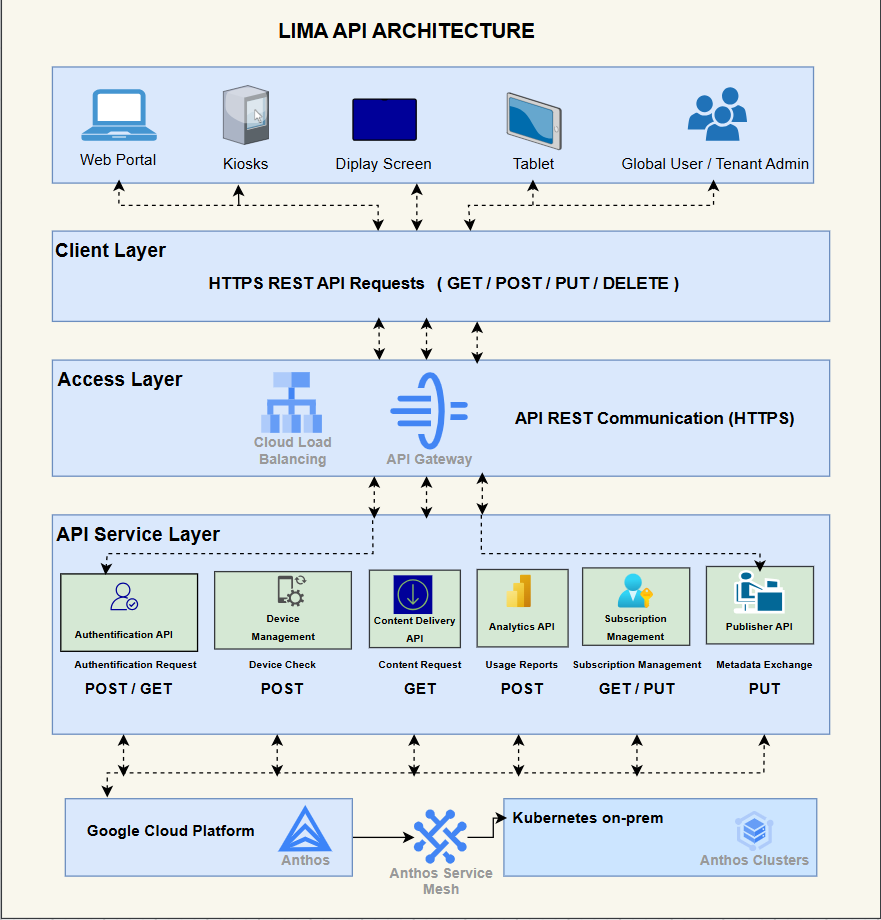

# Cloud Architecture

## 1. Introduction

The LIMA platform uses a hybrid cloud architecture based on Google Cloud Platform (GCP) and Anthos.

This design allows the platform to use cloud services while also connecting to private infrastructure. It supports secure communication, cloud storage, Artificial Intelligence services, analytics, and device management.

The architecture supports both Business-to-Business (B2B) and Business-to-Consumer (B2C) users. Libraries, bookstores, publishers, educational organisations, and global users can all access the platform through different devices and services.

---

## 2. High-Level Cloud Architecture

The high-level cloud architecture shows how users, organisations, devices, and cloud services are connected within the LIMA platform.

Libraries, bookstores, publishers, and educational organisations access the system through the Website Portal. They can create accounts, choose subscription plans, request devices, and register devices.

Global users access the platform through the LIMA AI Tablet, while tenant organisations use the Interactive Kiosk and Children's Reading Display.

    

**Figure 4.1.** High-level cloud architecture of the LIMA platform.

All devices and users communicate through the API Gateway. The API Gateway sends requests to the correct cloud service and helps protect the platform from unauthorised access.

Google Cloud Platform provides the main cloud environment for the LIMA system. It includes services for security, Artificial Intelligence, data storage, analytics, and application management.

Anthos connects Google Cloud Platform with the private cloud environment. This allows sensitive tenant and user information to remain inside private infrastructure while still using cloud services.

---

## 3. Google Cloud Platform Layers

The Google Cloud Platform architecture is divided into three main layers.

### 3.1 Access Layer

The Access Layer controls how users and devices connect to the platform.

It includes:

- Cloud CDN
- Multi-Factor Authentication
- Cloud Armor
- Google Kubernetes Engine
- Cloud IAM
- Cloud Logging

Cloud CDN helps deliver content faster.

Multi-Factor Authentication provides extra protection during login.

Cloud Armor protects the platform from common online attacks.

Cloud IAM controls which users and services can access cloud resources.

Cloud Logging records system activity and supports monitoring.

---

### 3.2 Application Layer

The Application Layer contains the main services used by the platform.

These include:

- Metadata Services
- Book Trailer Services
- Book Services
- Recommendation Engine
- Vertex AI

Metadata Services manage book information.

Book Trailer Services provide AI-generated trailer content.

Book Services manage book details and related information.

The Recommendation Engine suggests books based on user activity and book information.

Vertex AI supports AI features such as recommendations, reading support, and future content generation.

---

### 3.3 Storage Layer

The Storage Layer stores the information and media used by the platform.

It includes:

- Cloud SQL
- Firestore
- Cloud Storage
- Analytics Hub

Cloud SQL stores structured data such as book information, publishers, and metadata.

Firestore stores data that needs fast access and real-time updates.

Cloud Storage stores images, audio, video, and AI-generated book trailers.

Analytics Hub supports reporting and analysis of platform activity.

---

## 4. Hybrid Cloud and Anthos

Anthos is used to connect Google Cloud Platform with private infrastructure.

This allows LIMA to use a hybrid cloud model where some services run in the public cloud and sensitive data remains inside the private cloud environment.

The private cloud stores authorised tenant and user information, including account and payment data.

Anthos Service Mesh provides secure communication between cloud services and private Kubernetes clusters.

This design supports:

- Better data protection
- Central management
- Secure communication
- Flexible deployment
- Support for private and public cloud services

---

## 5. API Architecture

The LIMA platform uses REST APIs to allow users, devices, and cloud services to communicate.

All requests are sent through HTTPS. This helps protect information while it is travelling between devices and the cloud platform.

    

**Figure 4.2.** REST API architecture of the LIMA platform.

The API architecture is divided into four main layers:

- Client Layer
- Access Layer
- API Service Layer
- Cloud Infrastructure Layer

---

### 5.1 Client Layer

The Client Layer includes all users and devices that connect to the platform.

These include:

- Website Portal
- Interactive Kiosks
- Children's Reading Displays
- LIMA AI Tablets
- Global Users
- Tenant Administrators

These clients send GET, POST, PUT, and DELETE requests through HTTPS.

---

### 5.2 Access Layer

The Access Layer manages incoming requests.

It includes:

- Cloud Load Balancing
- API Gateway

Cloud Load Balancing distributes requests across available services.

The API Gateway checks each request and sends it to the correct API service.

---

### 5.3 API Service Layer

The API Service Layer contains the main services used by the platform.

These include:

#### Authentication API

Supports login, identity checks, and secure access.

Main request methods:

- POST
- GET

#### Device Management API

Checks and manages registered devices.

Main request method:

- POST

#### Content Delivery API

Provides book information, reading content, and multimedia services.

Main request method:

- GET

#### Analytics API

Receives platform usage information and creates reports.

Main request method:

- POST

#### Subscription Management API

Manages subscription plans and account updates.

Main request methods:

- GET
- PUT

#### Publisher API

Supports book metadata exchange between publishers and the LIMA platform.

Main request method:

- PUT

---

### 5.4 Cloud Infrastructure Layer

The API services connect to Google Cloud Platform and Kubernetes on-premises.

Anthos and Anthos Service Mesh manage the connection between the two environments.

This allows LIMA to use shared cloud services while keeping sensitive information within private infrastructure.

---

## 6. Security and Communication

The cloud architecture uses several security controls to protect users, organisations, and system data.

These include:

- HTTPS communication
- Multi-Factor Authentication
- Identity and Access Management
- API Gateway validation
- Cloud Armor
- Private cloud storage
- Secure Anthos Service Mesh communication
- Logging and monitoring

These controls reduce the risk of unauthorised access and help protect information across the platform.

---

## 7. Scalability

The cloud architecture has been designed to support future growth.

New organisations can join the platform without affecting existing tenants.

New devices can connect through the existing API Gateway.

Additional AI services can be added to the Application Layer.

Google Kubernetes Engine can support increased workloads as more users and devices access the platform.

This makes the architecture flexible and easier to expand.

---

## 8. Benefits of the Cloud Architecture

The main benefits of the proposed architecture are:

- Secure communication between devices and cloud services
- Support for multiple organisations
- Private storage for sensitive data
- Central management through Anthos
- Scalable cloud services
- Support for AI integration
- Faster content delivery
- Easy connection of new devices
- Better monitoring and analytics
- Flexible hybrid cloud deployment

---

## Summary

The LIMA cloud architecture combines Google Cloud Platform, Anthos, Kubernetes, APIs, Artificial Intelligence, and private infrastructure within one connected environment.

The high-level architecture explains how users, organisations, devices, and cloud services are connected. The API architecture explains how requests move between the client devices, API services, Google Cloud Platform, and the private cloud.

This design provides a secure, scalable, and flexible foundation for the LIMA platform. The next section presents the database design and explains how book information, AI content, tenants, subscriptions, devices, and payment data are organised.