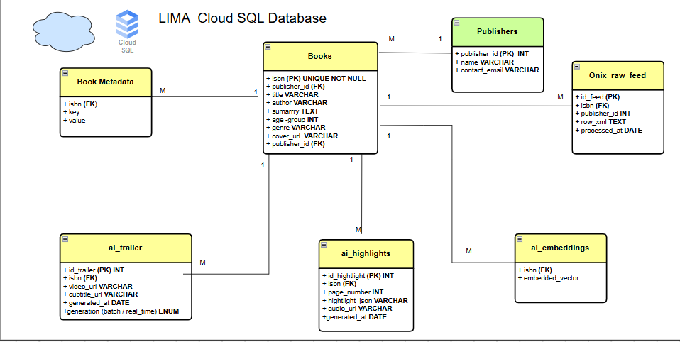
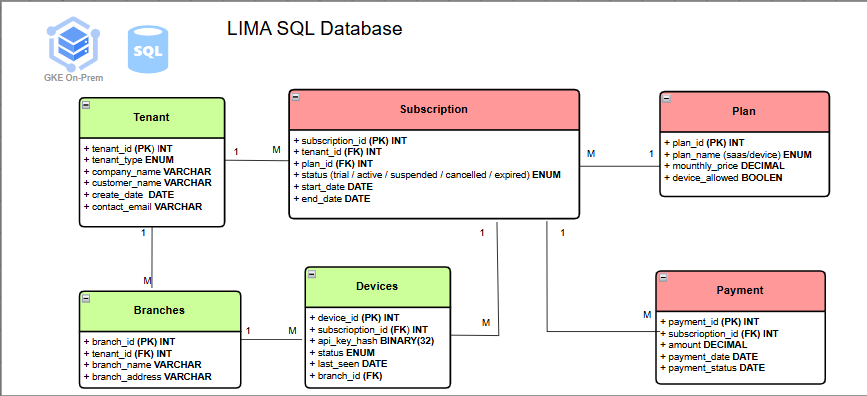

# Database Design

## 1. Introduction

The LIMA platform uses two main database areas to manage different types of information.

The first database stores book content, publisher information, AI-generated media, and book metadata.

The second database stores tenant information, subscriptions, devices, branches, and payment details.

Separating these databases helps keep the system organised, secure, and easier to manage.

---

## 2. Database Design Overview

The database design follows a clear separation between:

- Content and book data
- Tenant and business data

The content database is hosted in Google Cloud SQL.

The tenant database is kept within the private cloud environment.

This design allows the platform to manage shared book information in the cloud while protecting sensitive tenant and user information inside private infrastructure.

---

## 3. Cloud SQL Content Database

The Cloud SQL database stores the main book and AI content used by the LIMA platform.

It includes information about:

- Books
- Publishers
- Book metadata
- ONIX feeds
- AI-generated trailers
- AI-generated reading highlights
- AI embeddings

    

**Figure 5.1.** Cloud SQL database design for book and AI content.

---

## 4. Main Content Database Tables

### 4.1 Books Table

The Books table is the main table in the content database.

It stores:

- ISBN
- Book title
- Author
- Summary
- Age group
- Genre
- Cover image URL
- Publisher ID

The ISBN is used as the main identifier for each book.

This makes it easier to connect the same book across different services and systems.

---

### 4.2 Publishers Table

The Publishers table stores publisher information.

It includes:

- Publisher ID
- Publisher name
- Contact email

One publisher can be connected to many books.

---

### 4.3 Book Metadata Table

The Book Metadata table stores extra information about books.

It includes:

- ISBN
- Metadata key
- Metadata value

This table allows the platform to store additional details without changing the main Books table.

---

### 4.4 ONIX Raw Feed Table

The ONIX Raw Feed table stores book information received from publishers.

It includes:

- Feed ID
- ISBN
- Publisher ID
- Raw XML data
- Processing date

This allows LIMA to receive and process standard book metadata from publishers.

---

### 4.5 AI Trailer Table

The AI Trailer table stores AI-generated book trailers.

It includes:

- Trailer ID
- ISBN
- Video URL
- Subtitle URL
- Generation date
- Generation type

One book can have one or more AI-generated trailers.

---

### 4.6 AI Highlights Table

The AI Highlights table stores reading highlights and learning content.

It includes:

- Highlight ID
- ISBN
- Page number
- Highlight data
- Audio URL
- Generation date

This table supports text highlighting, narration, and interactive reading.

---

### 4.7 AI Embeddings Table

The AI Embeddings table stores vector representations of books.

It includes:

- ISBN
- Embedded vector

These vectors can be used by the recommendation engine and semantic search services.

---

## 5. Content Database Relationships

The Books table is the central table in the content database.

It is connected to:

- Publishers
- Book Metadata
- ONIX Raw Feed
- AI Trailers
- AI Highlights
- AI Embeddings

The ISBN is used as the main connection between book-related tables.

This creates a clear and consistent way to manage book information across the platform.

---

## 6. Private Tenant Database

The private tenant database stores business and account information.

This information is kept inside private infrastructure because it may include sensitive organisational, subscription, device, and payment data.

The tenant database includes:

- Tenants
- Subscriptions
- Plans
- Payments
- Devices
- Branches

    

**Figure 5.2.** Private tenant database design for organisations, subscriptions, devices, and payments.

---

## 7. Main Tenant Database Tables

### 7.1 Tenant Table

The Tenant table stores information about each organisation using the platform.

It includes:

- Tenant ID
- Tenant type
- Company name
- Customer name
- Creation date
- Contact email

One tenant can have many branches and subscriptions.

---

### 7.2 Subscription Table

The Subscription table stores subscription details.

It includes:

- Subscription ID
- Tenant ID
- Plan ID
- Status
- Start date
- End date

The subscription status can show whether the plan is:

- Active
- Suspended
- Cancelled
- Expired

---

### 7.3 Plan Table

The Plan table stores available subscription plans.

It includes:

- Plan ID
- Plan name
- Monthly price
- Device allowance

One plan can be used by many subscriptions.

---

### 7.4 Payment Table

The Payment table stores payment information.

It includes:

- Payment ID
- Subscription ID
- Amount
- Payment date
- Payment status

Each payment is linked to a subscription.

---

### 7.5 Devices Table

The Devices table stores registered device information.

It includes:

- Device ID
- Subscription ID
- API key hash
- Device status
- Last seen date
- Branch ID

This table helps the platform monitor and manage connected devices.

---

### 7.6 Branches Table

The Branches table stores information about organisational locations.

It includes:

- Branch ID
- Tenant ID
- Branch name
- Branch address

One tenant can have several branches.

Each branch can have one or more registered devices.

---

## 8. Tenant Database Relationships

The Tenant table is the main business table.

It is connected to:

- Subscriptions
- Branches

The Subscription table is connected to:

- Plans
- Payments
- Devices

The Branches table is also connected to Devices.

These relationships allow each organisation to manage its branches, subscriptions, payments, and connected devices.

---

## 9. Why the Databases Are Separated

The two databases are separated because they store different types of information.

### Cloud SQL Database

Stores shared platform content such as:

- Books
- Publishers
- Metadata
- AI trailers
- AI highlights
- AI embeddings

### Private Tenant Database

Stores sensitive business information such as:

- Tenant accounts
- Subscription plans
- Payments
- Branches
- Registered devices

This separation provides several benefits:

- Better security
- Clear data organisation
- Easier maintenance
- Better performance
- Safer multi-tenant management
- Easier future expansion

---

## 10. Data Security

The database design includes several security controls.

These include:

- Primary and foreign keys
- Unique ISBN values
- Hashed API keys
- Private storage for sensitive tenant data
- Controlled database access
- Secure API communication
- Role-based permissions
- Backup and recovery support

These controls help protect the accuracy, privacy, and security of platform data.

---

## 11. Scalability

The database design can support future growth.

New publishers, books, tenants, branches, subscriptions, and devices can be added without changing the overall structure.

AI tables are also separated from the main Books table, making it easier to add new AI services in the future.

This design supports a growing number of users and organisations.

---

## Summary

The LIMA database design separates book and AI content from tenant and business information.

The Cloud SQL database manages books, publishers, metadata, AI trailers, AI highlights, and AI embeddings.

The private tenant database manages organisations, subscriptions, plans, payments, branches, and devices.

This separation creates a secure, organised, and scalable data structure for the LIMA platform. The next section explains the security architecture used to protect users, organisations, devices, APIs, and cloud services.