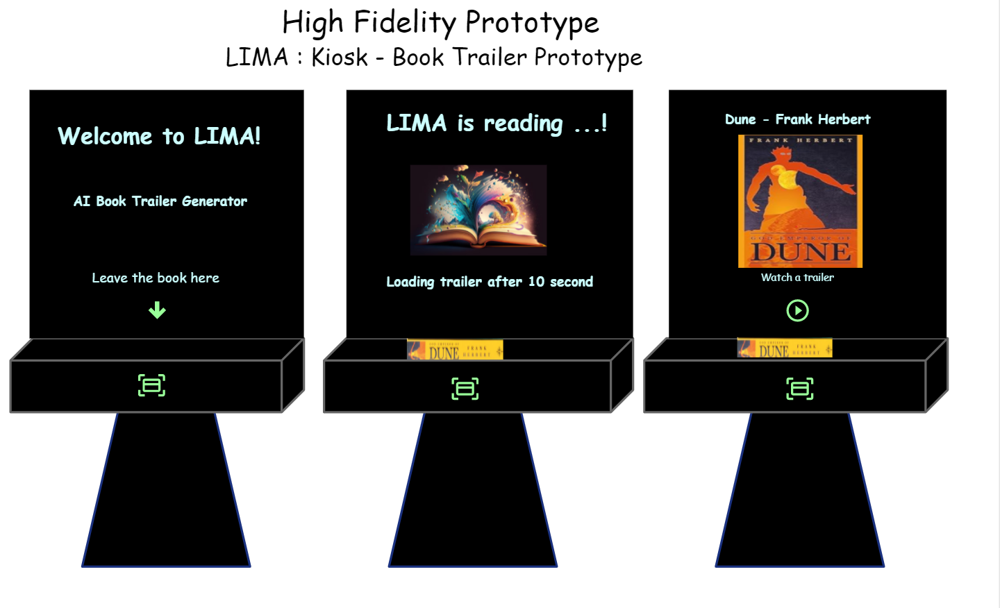
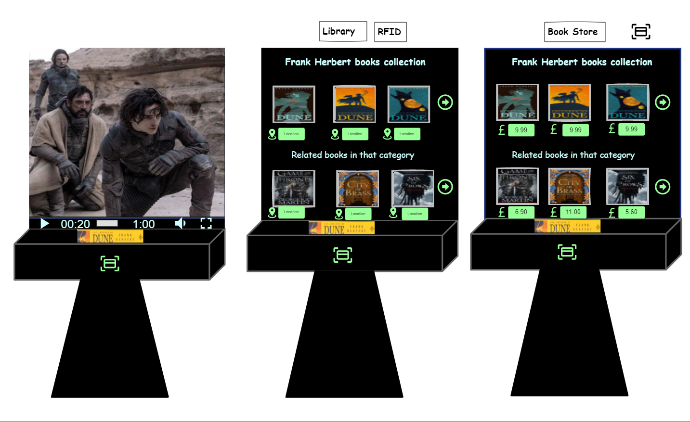
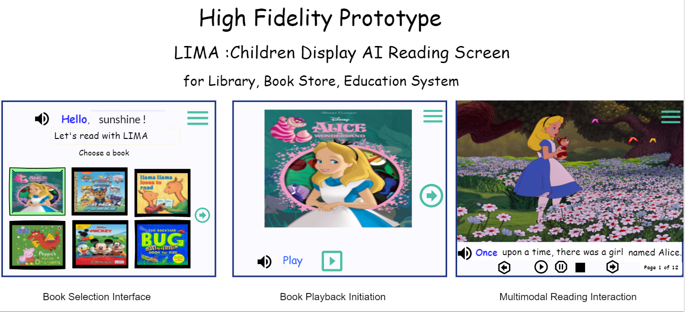

# High-Fidelity Prototypes

## 1. Introduction

The LIMA high-fidelity prototypes were designed using Figma to demonstrate the proposed user interface before software development. The prototypes validate the navigation, layout, functionality, and user experience of the platform while supporting the functional and non-functional requirements defined in previous sections.

The interfaces have been designed for different user roles, including public visitors, tenant organisations, and individual users. Although the platform has not been implemented, these prototypes provide a realistic representation of the final system and demonstrate how users interact with the cloud-based services.

---

# 2. Public Website

The public website is the main entry point to the LIMA platform. It introduces visitors to the available smart learning devices, explains the platform's purpose, and allows organisations and individual users to create an account.

The homepage provides access to:

- About LIMA
- Devices
- Contact Information
- Subscription Plans
- Registration
- Login

The three smart devices are presented on the homepage:

- AI Trailer Kiosk
- Children's Reading Display
- LIMA AI Tablet

Visitors can learn about each device before registering or requesting a subscription.

    

**Figure 11.1.** LIMA public website.

---

# 3. Login Interface

The login page provides secure authentication for both organisations and individual users.

The interface includes:

- Business or Personal Email
- Password
- Password Recovery
- Multi-factor Authentication
- Email Verification

The design follows a simple layout to reduce user complexity while improving account security.

    

**Figure 11.2.** Login interface.

---

# 4. Registration Interface

The registration prototype supports two different account types:

- Company / Organisation
- Primary User

The organisation registration allows businesses such as libraries, bookstores, and educational institutions to create tenant accounts.

The personal registration enables parents and individual users to access the LIMA AI Tablet platform.

Each registration process includes subscription selection and basic account information while maintaining secure authentication.

    

**Figure 11.3.** Registration interface.

---

# 5. Tenant Dashboard

The tenant dashboard enables organisations to manage all deployed LIMA devices through a single cloud portal.

The dashboard provides:

- Branch management
- Device monitoring
- Device health overview
- Active subscriptions
- Software updates
- Device alerts
- Billing management
- Device requests
- Analytics

The interface allows administrators to monitor the operational status of kiosks and children's reading displays across multiple branches.

    

**Figure 11.4.** Tenant management dashboard.

---

# 6. User Dashboard

The personal dashboard is designed for parents using the LIMA AI Tablet.

The dashboard provides access to:

- Parent Controls
- Reading Analytics
- Subscription Management
- Device Registration
- Learning Progress
- Reading Statistics
- Requested Content

Parents can monitor children's reading activity, configure device settings, and manage subscriptions from a single interface.

    

**Figure 11.5.** User dashboard.

---

# Summary

The high-fidelity prototypes demonstrate the proposed appearance and functionality of the LIMA platform before implementation. The interfaces provide a realistic representation of the complete user journey, from public access and account registration to cloud-based management of devices and personalised learning services. The prototypes also validate the usability, navigation, and consistency of the platform while supporting the functional requirements presented throughout this portfolio.

# 2. AI Trailer Kiosk Prototype

The AI Trailer Kiosk prototype demonstrates the interaction between users and the intelligent book discovery system. The prototype illustrates the complete user journey, beginning with book identification through RFID or barcode scanning and ending with personalised recommendations.

The first prototype presents the initial interaction with the kiosk. After the user places a book on the RFID reader or scans its barcode, the system recognises the selected title, retrieves the associated metadata, and prepares the multimedia content. Once processing is complete, the kiosk displays the book cover together with an option to watch the AI-generated trailer.

    

**Figure 11.1.** AI Trailer Kiosk interaction prototype.

---

The second prototype illustrates the remaining interaction after the trailer begins playing. Following the trailer presentation, the kiosk displays additional books written by the same author together with related recommendations based on category and genre. Within bookstore environments, pricing information is displayed, while library installations present shelf locations to help visitors locate the recommended books.

    

**Figure 11.2.** AI Trailer Kiosk recommendation interface.

# 3. Children's AI Reading Display Prototype

The Children's AI Reading Display prototype demonstrates an interactive multimodal reading experience designed for libraries, bookstores, and educational environments. The interface combines digital books, AI narration, illustrations, and touch interaction to encourage independent reading while supporting early literacy development.

The prototype illustrates the complete user journey through three interaction stages.

The first screen presents the book selection interface, where children can browse an illustrated digital library and choose a book using simple touch controls. Voice guidance welcomes the child and provides instructions before reading begins.

The second screen displays the selected book and allows the child to start AI narration using simple playback controls. The interface has been designed with large buttons and minimal distractions to improve usability for young readers.

The final screen demonstrates the multimodal reading experience. As the narration plays, the story is displayed together with animated illustrations while spoken words are synchronised with highlighted text. Navigation controls allow children to pause, replay, or move between pages independently.

    

**Figure 11.3.** High-fidelity prototype of the Children's AI Reading Display showing book selection, playback, and multimodal reading interaction.